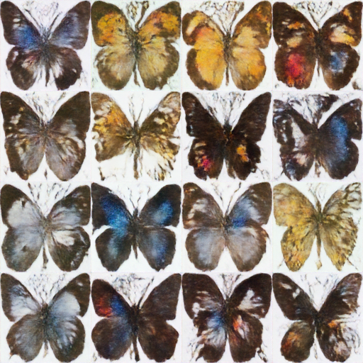

# minimal-ddpmp

## Installation and running

```bash
# optinal virtual env to keep it clean
python3 -m venv venv
source venv/bin/activate
```

```bash
pip install -r requirements.txt
```

```bash
# to replicate just run 
python train.py
# or also you can set this args
python train.py --image_size 128 --train_batch_size 64 --num_epochs 50 --learning_rate 1e-4
```

## Results after 50 epoch


